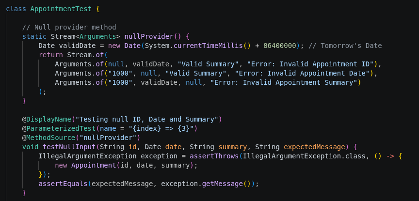
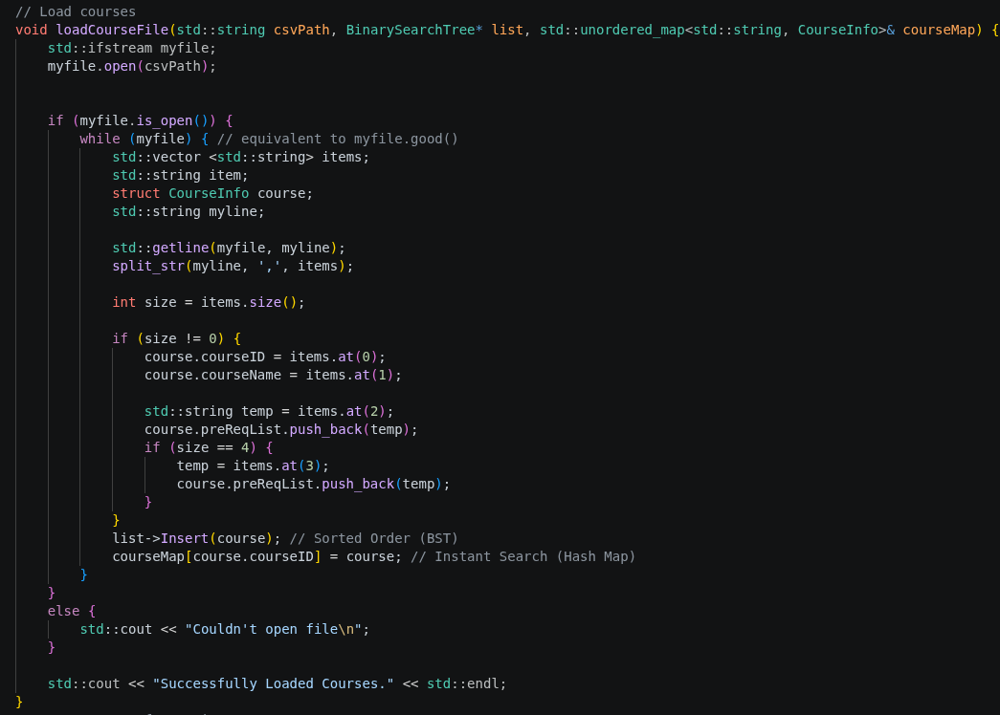
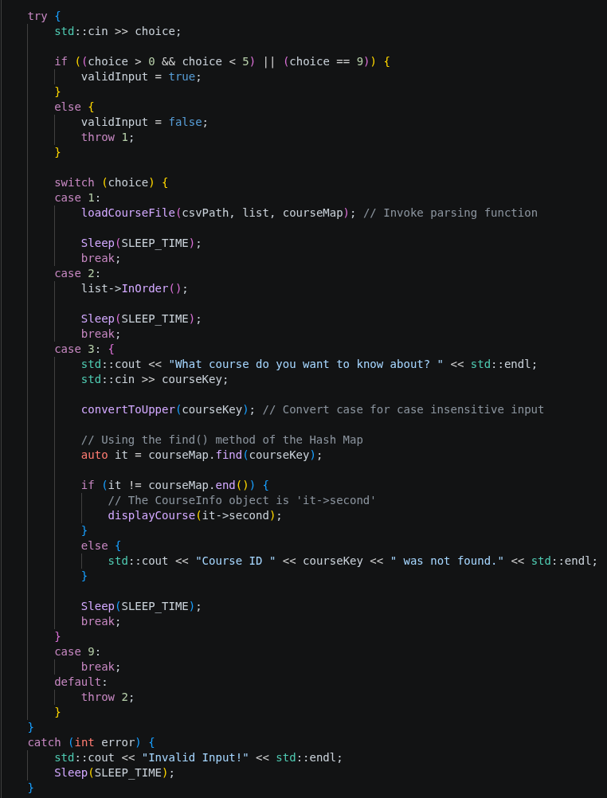
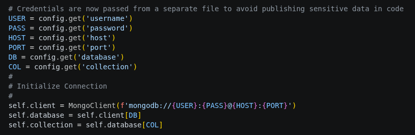
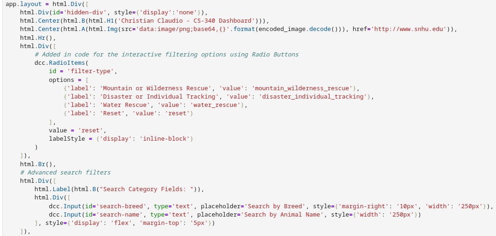

<h1 align="center">CClaudio1990.github.io</h1>

<h2 align="center">Welcome to my ePortfolio!</h2>

# Introduction
My name is Christian Claudio and I am a former U.S. Army Infantryman currently working as a Technical Consultant for a major open source software company. I started my journey at SNHU in January 2024 to finish my BS Computer Science after my 10 years of serving in the Army. I plan to keep moving along my current path post degree.

# Educational Reflection
My time at SNHU has been one of immense growth. I had only just transistioned from the Army a few months prior and started a new job as a Technical Account Manager for an enterprise automation software company so I really was able to enhance my knowledge and skills. I already had some experience using C++, Java and Python but gained so much from this program. I enhanced my knowledge of security and coding best practices and used some of it in my work to great effect. Work and school have had a mutually beneficial relationship for me. Now, I use experience I gain from my current job to augment my work for the CS program. Using all of this new knowledge I have been able to make strong enhancements to artifacts I have created in my time here.

# Code Review ``</>`` 💻

  <iframe src="https://youtube.com/embed/kl3xGilFJAw" 
          style="position: absolute; top: 0; left: 0; width: 100%; height: 100%; border: 0;" 
          allow="accelerometer; autoplay; clipboard-write; encrypted-media; gyroscope; picture-in-picture; web-share" 
          allowfullscreen>
  </iframe>

* In this video, I introduce the artifacts that I have made enhancements to for each of three categories.
  * Software Engineering & Design
  * Algorithms & Data Structures
  * Databases

<h1 align="center">Artifacts</h1>

# <u>Category One:</u> Software Engineering & Design (CS-320 Appointment JUnit Testing)
This artifact is an appointment tracking system that contains the ID, name, phone number and date for the appointment object. For the Appointment and Appointment Service code in this artifact, I originally handled testing in the most basic way required for the course. Each testing instance covered one scenario. To enhance it, I took separate tests for the same type of error and combined them into a single parameterized test block. This method is far more efficient both in how the tests work, but also how much code there is to read through. I also added some additional comments to enhance a viewers understaning of the code.

**Refactored Version:**

# <u>Category Two:</u> Algorithms & Data Structures (CS-300 Binary Search Tree Course Catalog)
This artifact is a course search catalog that originally used a Binary Search Tree data structure. The goal is to create an ordered list that can be displayed and courses can be looked up. I enhanced the artifact by adding a hash map that gives the search function O(1) time complexity. Doing this means that this artifact is a BST/Hash Map hybrid. Given that the dataset for this project is not extremely complex and massive, the difference in search time is negligible. However, I chose to do this to demonstrate how it can have a much more profound impact when dealing with much larger and complex datasets.

**Refactored Version:**

# <u>Category Three:</u> Databases (CS-340 Grazioso Salvare Rescue Animal Search)
This artifact represents a refined and optimized iteration of the original dashboard application, focusing heavily on security, feature expansion, and system stability. By decoupling sensitive information, the application now reads database credentials from an external credentials.json file, mitigating hardcoding risks. The user experience is significantly enhanced through the introduction of advanced search capabilities—specifically search_breed and search_name modules—allowing for targeted data querying directly from the interface. Furthermore, critical backend improvements were implemented, including a logic overhaul in the geolocation module to eliminate potential index-out-of-range crashes, and a framework migration from the deprecated jupyter_dash library to the modern, natively supported dash ecosystem.

**Refactored Version:**

